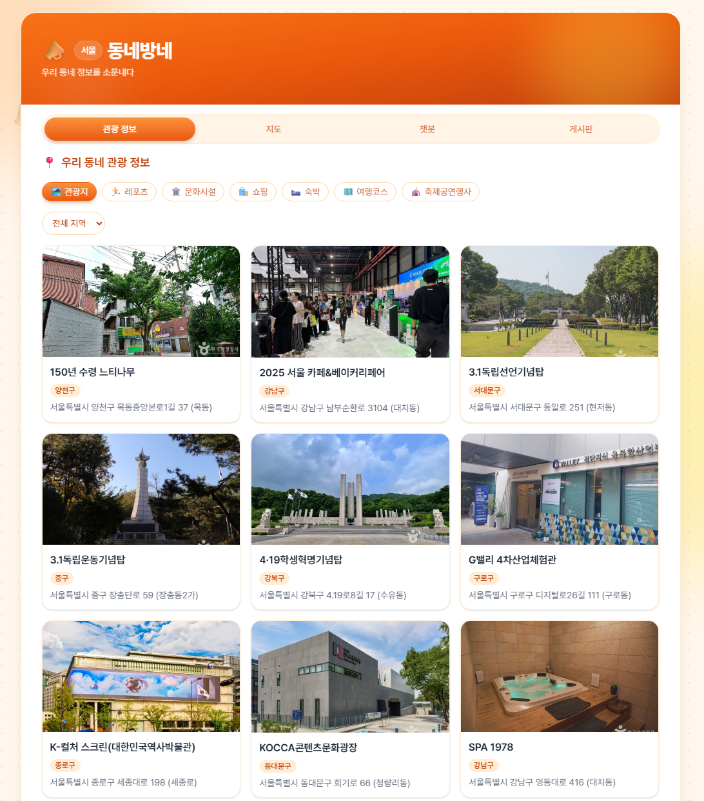
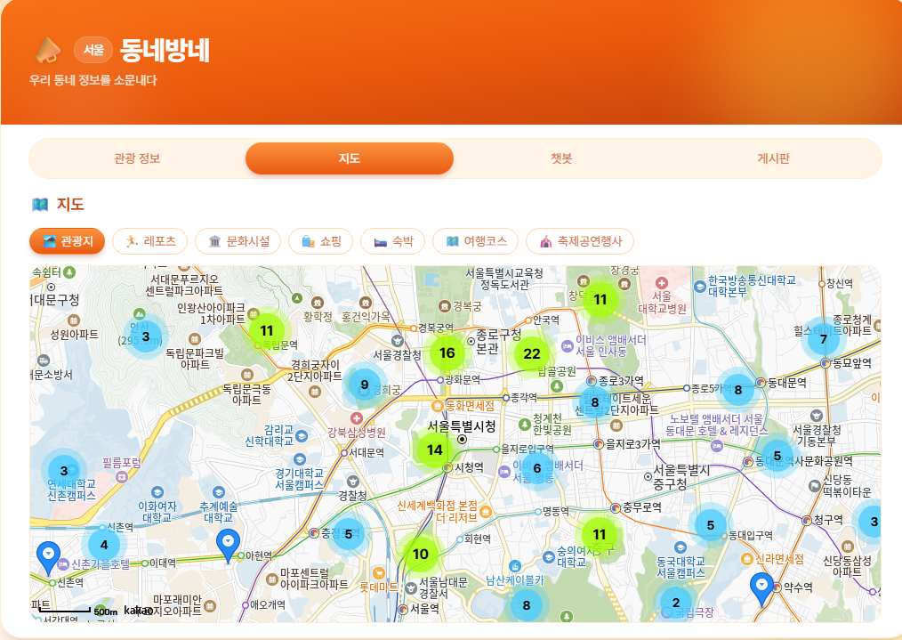
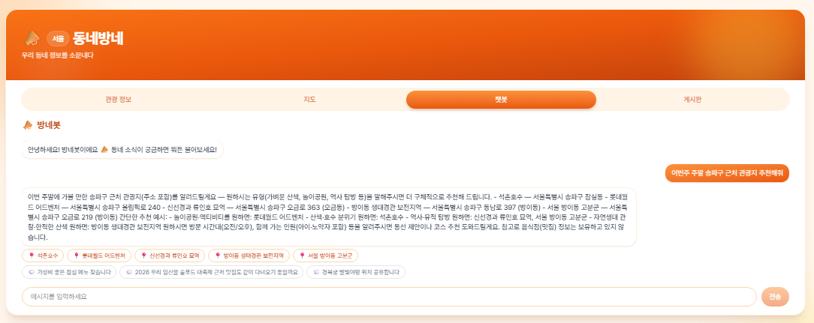

# 동네방네 (DongNaeBangNae)

서울 지역 관광 정보와 익명 커뮤니티, AI 챗봇을 제공하는 FastAPI 기반 서비스입니다.

## 개발 스택

- Frontend: Vue
- Backend: Python / FastAPI
- Database: SQLite / SQLAlchemy
- AI: OpenAI API

## 주요 기능

### 🗺️ 관광 정보
서울 지역 관광 정보를 관광지, 레포츠, 문화시설, 쇼핑, 숙박, 여행코스, 축제·공연·행사 등 카테고리별로 탐색할 수 있습니다. 자치구별 필터링을 지원해 우리 동네 근처 명소를 쉽게 찾을 수 있습니다.

### 📍 지도
관광 정보를 지도 위에서 한눈에 확인할 수 있습니다. 지역별 클러스터로 데이터 개수를 표시해, 어느 동네에 어떤 정보가 많은지 직관적으로 파악할 수 있습니다.

### 🤖 챗봇 (방네봇)
동네 관광 정보를 기반으로 답변하는 AI 챗봇입니다. "이번주 주말 송파구 근처 관광지 추천해줘"처럼 자연어로 질문하면, 관련 장소와 게시글을 참고해 구체적인 추천과 근거 자료를 함께 보여줍니다.

### 💬 게시판
회원가입 없이 비밀번호만으로 글을 쓰고 소통하는 익명 게시판입니다. 축제·맛집 등 카테고리별로 정보를 공유하고, 좋아요·댓글·공유하기로 자유롭게 소통할 수 있습니다.

## 🛠️ 기술적 의사결정

동네방네를 만들며 고민했던 부분들을 남겨둡니다.

### 익명 사용자 식별 : X-Client-Id
로그인 없는 서비스에서 좋아요·조회수 중복을 막으려면 사용자를 구분할 최소한의 식별자가 필요했습니다.

IP와 User-Agent를 조합해 해시하는 방식도 검토했지만, 공유망(NAT)이나 모바일 캐리어 환경에서는 서로 다른 사용자가 같은 IP를 쓰는 경우가 많아 동일인으로 오판할 수 있고, IP라는 개인정보를 서버가 다루게 된다는 문제도 있어 배제했습니다.

대신 프론트엔드가 UUID v4를 생성해 `localStorage`에 저장하고, 매 요청마다 `X-Client-Id` 헤더로 전달하는 방식을 택했습니다. 서버는 이 값을 인증 수단이 아니라 순수 중복 판정용 키로만 사용합니다.

브라우저 저장소를 초기화하면 우회할 수 있다는 한계는 남아 있지만, 로그인 없는 익명 서비스에서는 감수할 수 있는 트레이드오프라고 판단했습니다.

### 이미지 저장 : 파일시스템 대신 SQLite BLOB
게시글에 이미지를 첨부하려면 어딘가에 파일을 저장해야 하는데, Render 무료 플랜은 파일시스템이 휘발성이라 로컬 디스크에 저장하면 재배포·재시작마다 이미지가 사라집니다.

S3나 Cloudinary 같은 외부 스토리지도 검토했지만, 계정 발급·API 키 관리·SDK 연동까지 필요해 잔여 일정 안에 처리하기엔 부담이 컸습니다.

그래서 이미지를 SQLite BLOB 컬럼에 직접 저장하는 방식을 택했습니다. 제출물인 `.db` 파일 자체가 이미지까지 포함한 자기완결적인 산출물이 된다는 장점도 있었습니다.

다만 SQLite 자체도 Render에서는 휘발성이라는 근본적인 한계는 남아 있어, 파일당 2MB·게시글당 3장 제한과 Pillow를 통한 리사이즈로 DB 파일 크기 팽창만이라도 완화했습니다.

### 비정규화 카운터
조회수, 좋아요 수, 댓글 수는 `post_views`, `post_likes`, `comments`와 같은 1:N 관계의 테이블을 매번 집계해 계산할 수도 있습니다. 하지만 이 방식에는 두 가지 문제가 있습니다.

첫째, 여러 1:N 테이블을 하나의 쿼리에서 동시에 JOIN하면 행이 서로 곱해져 COUNT 값이 실제보다 크게 계산될 수 있습니다. 이는 서브쿼리나 사전 집계를 통해 해결할 수 있지만, 쿼리 구조가 복잡해집니다.

둘째, `sort=views`, `sort=likes`, `sort=comments`처럼 집계값을 기준으로 정렬하려면 요청마다 자식 테이블의 데이터를 집계한 뒤 정렬해야 합니다. 이 경우 집계 결과는 테이블에 직접 저장된 값이 아니므로 일반적인 인덱스를 활용하기 어렵고, 데이터가 증가할수록 조회 비용이 커질 수 있습니다.

따라서 `posts` 테이블에 조회수, 좋아요 수, 댓글 수를 저장하는 비정규화 카운터 컬럼을 두고, `ix_posts_like_count`와 같은 인덱스를 생성해 집계값 기준 정렬에서도 인덱스를 활용할 수 있도록 설계했습니다.

좋아요·댓글 데이터의 생성 및 삭제와 카운터 갱신을 동일한 트랜잭션으로 처리해, 일부 작업만 반영되면서 원본 데이터와 카운터 값이 불일치하는 상황을 방지했습니다.

### 선택적 API 버저닝
기능을 추가할 때마다 API 전체를 새 버전으로 올리는 방법도 있었지만, 그렇게 하면 요청·응답 계약이 전혀 바뀌지 않은 엔드포인트(비밀번호 확인, 삭제)까지 프론트엔드가 버전을 맞춰 마이그레이션해야 합니다.

그래서 실제로 계약이 바뀐 엔드포인트(목록/상세 조회, 작성, 수정)만 `/api/v2`로 옮기고, 계약이 그대로인 엔드포인트는 v1 경로를 그대로 유지했습니다.

이렇게 하면 변경이 없는 부분에는 마이그레이션 비용이 전혀 들지 않고, 실제로 바뀐 부분에만 비용이 집중됩니다.

### SQLite 외래키 제약의 함정
SQLite는 기본적으로 외래키 제약을 강제하지 않습니다. 스키마에 `ON DELETE CASCADE`를 선언해 두어도, 커넥션마다 `PRAGMA foreign_keys=ON`을 명시적으로 설정하지 않으면 조용히 무시됩니다.

이 상태에서는 게시글을 삭제해도 연결된 댓글·좋아요·이미지가 지워지지 않고 고아 레코드로 남습니다. 더 위험한 건 에러가 나지 않는다는 점입니다.

그래서 SQLAlchemy 엔진의 커넥션 이벤트 리스너에서 커넥션을 맺을 때마다 `PRAGMA foreign_keys=ON`을 실행하도록 해, 이 문제를 사전에 차단했습니다.

### 테스트
`pytest-cov` 기준 전체 테스트 커버리지는 91%입니다. 유닛 테스트만으로는 실제 동작을 보장하기 어려운 부분—이미지 업로드, 조회수 중복 방지, 게시글 삭제 시 CASCADE 삭제—은 서버를 직접 띄워 end-to-end로 재확인했습니다.

